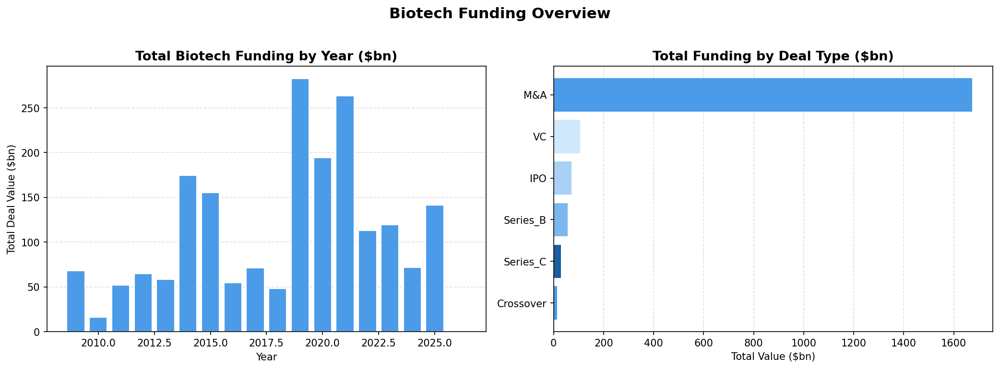
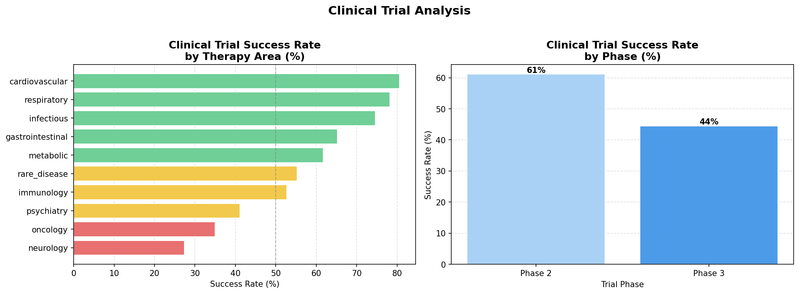
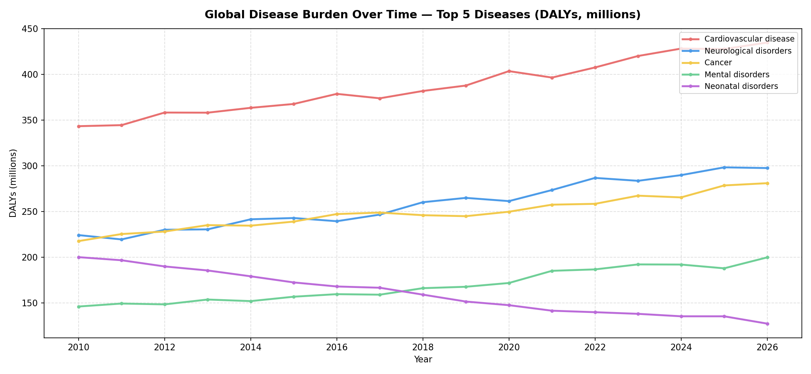
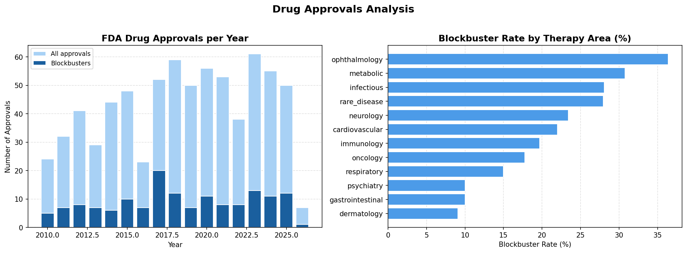
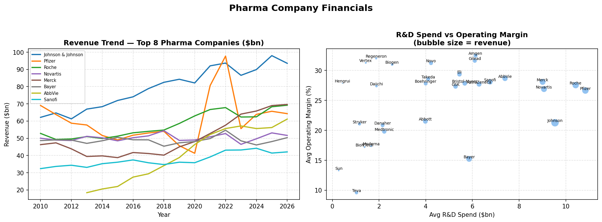

# 💊 Global Healthcare & Pharma Analysis (2010–2026)

## Project Overview

This project analyses the global pharmaceutical and healthcare industry using 5 real-world datasets from Kaggle, covering 17 years of data (2010–2026).

The analysis explores biotech funding trends, clinical trial outcomes, disease burden by region, FDA drug approvals, and the financial performance of the world's top 30 pharma companies.

## Dataset

Source: [Global Healthcare & Pharma 2010-2026](https://www.kaggle.com/datasets/sergionefedov/global-healthcare-and-pharma-2010-2026) — Kaggle (CC0: Public Domain)

| File | Description | Rows |
|---|---|---|
| `biotech_funding.csv` | Biotech deals (VC, M&A, Series B) | 1,208 |
| `clinical_trials.csv` | Clinical trial outcomes by phase | 599 |
| `disease_burden.csv` | DALYs by disease and region | 3,310 |
| `drug_approvals.csv` | FDA drug approvals with sales estimates | 722 |
| `pharma_companies_financials.csv` | Revenue, R&D, margins for 30 companies | 489 |

## Tools & Libraries

- Python
- pandas
- matplotlib
- numpy

## Project Structure

```
pharma-analysis/
│
├── data/                          # Raw CSV files from Kaggle
├── output/                        # Generated charts
├── analysis.py                    # Main analysis script
├── requirements.txt
└── README.md
```

## Key Findings

### 💰 Biotech Funding
- **$1,949.7bn** in total deal value across 1,208 deals (2009–2026)
- Largest single deal: **Celgene acquisition at $74bn** (2019)
- Only **4% of deals** qualify as megadeals — but they dominate total value

### 🔬 Clinical Trials
- Overall trial success rate: **52.1%**
- **Phase 2** has the highest success rate — surprising given Phase 3 is the final hurdle
- Average trial enrolls **790 patients**

### 💊 Drug Approvals
- **722 total FDA approvals** across 17 years
- **21.2% blockbuster rate** — 1 in 5 approved drugs becomes a blockbuster
- **Oncology** is the most approved therapy area

### 🏢 Pharma Financials
- **Johnson & Johnson** leads in average annual revenue
- **Pfizer** spends the most on R&D on average
- Higher R&D spend does not always correlate with higher operating margins

## Visualisations







## How to Run

```bash
git clone https://github.com/alinamusteata34-hub/pharma-analysis.git
cd pharma-analysis
pip install -r requirements.txt
python analysis.py
```
